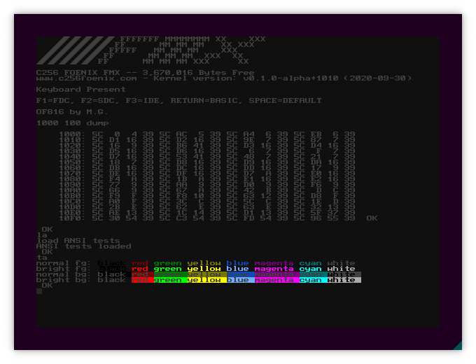

# go65c816 with m68k support

This branch was created for experiments with additional CPU cards,
announced for [C256 Foenix Gen X](https://c256foenix.com/). 

It means, that - contrary to name - emulator has preliminary support
for running Motorla 68000 as secondary CPU.

At this moment You should consider following factors:

* **MOST IMPORTANT:** it is unofficial work and features/lack 
  of featuers or emulator design does not correspond to features 
  or design of real Gen X machine! 

  Do not make any unauthorized assumptions about real hardware!

* Adding secondary CPU causes some refactoring in code, thus
  some debug features, described below, are not available now.

* Secondary CPU support in emu is very incomplete.

* Affordable speed for second CPU isn't impressive (at this moment
  it is manually capped at 2Mhz, max available does not exceeded
  12Mhz) - of course it depends from machine, but difference from
  go65c816 (40Mhz) is significant. 

  There is a possibility, that this version of emulator never will
  be in pair with real m68k hardware.


## Build instructions for this branch

As m68k I use Musashi core, built-in into emulator with some black
magic around ``cgo``. At first we need a object files '*.o' built
from Musashi.

Following instructions was tested with go1.13.8.

```
$ git clone https://github.com/kstenerud/Musashi/
$ cd  Musashi
$ make
$ ls *o softfloat/*o
m68kcpu.o  m68kdasm.o  m68kops.o  softfloat/softfloat.o
$ cd ..
```

If we can see four object files, as described above, then we can
try to build emulator:

```
$ git clone https://github.com/aniou/go65c816
$ cd go65c816
$ git checkout m68k
$ cd lib/musashi-c-wrapper
$ gcc -std=c99 -I ../../../Musashi -Wall -c shim.c
$ cd ../../cmd/gui
$ export CGO_LDFLAGS_ALLOW=".+/(Musashi|musashi-c-wrapper)/.+\.o"
$ go build -a -o gui *go
$ ./gui m68k.ini
```

After that we should see a normal Foenix kernel, running by 65c816
and small, red letter 'A', visible in top-left corner of screen -
this is only effect of m68k, working in tight loop on predefined
memory.

## Creating HEX files for M68k CPU

You need an [VASM assembler](http://sun.hasenbraten.de/vasm/) and
``srec_cat`` command (on Ubuntu it comes in package ``srecord``).

When You ocmpile VASM for selected target (i.e. Motorola):

```
$ cat test.asm

        org    $00100000

init:
        moveq  #$43,d0
        move.b d0,$00AFA000
        bra    init

$ ./vasmm68k_mot -Fbin -o test.bin  test.asm
$ srec_cat test.bin -binary -offset 0x100000 -o test.hex -intel
```

## Important changes

* 2021-06-22: there is an important change in ``*.ini`` files format,
  from now there are two sections available - ``cpu0`` and ``cpu1``
  with only two keywords, so far: ``file`` (and ``file1 - file99``)
  that loads Intel Hex files into RAM, tied to specific CPU  and 
  ``start`` keyword, that set PC (and only PC).

  ```ini
  [cpu0]
  file1=../../data/kernel.hex

  [cpu1]
  file=../../../vasm/test.hex
  start=0x10:0000
  ```

# Original README

**Warning:** original README comes from main branch, emulator created
only for single, 65c816-based computer. Following instructions may not
fit for current branch!

## Some screenshots

[of816 port](https://github.com/aniou/of816/tree/C256/platforms/C256)



Simple overlay test


Simple disassembler


## Supported systems

Program was tested on:

* Ubuntu 20.04 / Go 1.13
 
Word of warning: my SDL code is rather naive, so there is a possibility that
it would not work on Your system (bizarre colors or something). It may be
corrected in future.

## Emulation state

Current emulation state is rather sparse - C256 has 
[plenty of features](https://wiki.c256foenix.com/index.php?title=Main_Page),
and at this moment I was able to implement only small subset of them. For
full-fledged emulator see [Foenix IDE](https://github.com/Trinity-11/FoenixIDE).

### Vicky II

See [here](https://wiki.c256foenix.com/index.php?title=VICKY_II) for VICKY II spec

- [x] 640x480 mode
- [ ] 800x600 mode
- [ ] double pixel mode
- [x] fullscreen mode
- [x] border support (partial, no scroll)
- [x] text mode 
- [x] text LUT
- [x] cursor (but no second font bank)
- [x] fonts
- [x] bm0 bitmap
- [x] bm1 bitmap
- [x] bitmap LUT
- [x] overlay and background support
- [ ] tiles
- [ ] sprites
- [ ] GAMMA LUT
- [ ] 8-bit writes (Vicky writes are 8-bit even if A/X/Y are 16-bits wide)

### GABE

See [here](https://wiki.c256foenix.com/index.php?title=GABE) for GABE spec

- [x] math coprocessor
- [x] keyboard input (GABE)
- [ ] mouse
- [ ] all other

### general features

- [x] IRQ (partial: only 65c816 mode)
- [ ] NMI
- [ ] reset button

## Keybindings

There are few keybindings now. 
*Warning:* following keys aren't passed to emulator!

|Key     |Effect
---------|---------------------------
F9       |Toggle disassembler output
F10      |- (nothing)
F11      |Toggle full-screen
F12      |Exit emulator

## Memory map

Machine parameters may be tweaked by editing `emulator/platform/platform.go` file. Every memory area should be attached to internal bus, like in following example:

```go
        bus, _           := bus.New()
        platform.CPU, _   = cpu65c816.New(bus)
        ram, _           := memory.New(0x400000, 0x000000)
        platform.GPU, _   = vicky.New()
        platform.GABE, _  = gabe.New()

        platform.CPU.Bus.Attach(ram,            "ram", 0x000000, 0x3FFFFF)
        platform.CPU.Bus.Attach(platform.GPU, "vicky", 0xAF0000, 0xEFFFFF)
        platform.CPU.Bus.Attach(platform.GABE, "gabe", 0xAF1000, 0xAF13FF)

        platform.CPU.Bus.EaWrite(0xFFFC, 0x00)  // boot vector
        platform.CPU.Bus.EaWrite(0xFFFD, 0x10)
        platform.CPU.Reset()

```

 * minimal area size: **16 bytes**
 * areas **must be** aligned at 4 bits (16 bytes)
 * areas are stacked, i.e. later shadows previous 

## Foreword

Project was inspired by [NES emulator](https://github.com/fogleman/nes) created by Michael Fogleman and [MOS 6502 emulator](https://github.com/pda/go6502) by Paul Annesley and contains files or concepts from both projects. Some algorithms and behaviours are modeled on the [C++ 65c816 emulator](https://github.com/andrew-jacobs/emu816) by Andrew Jacobs.

Project draws inspiration and code snippets from [Foenix IDE](https://github.com/Trinity-11/FoenixIDE)

